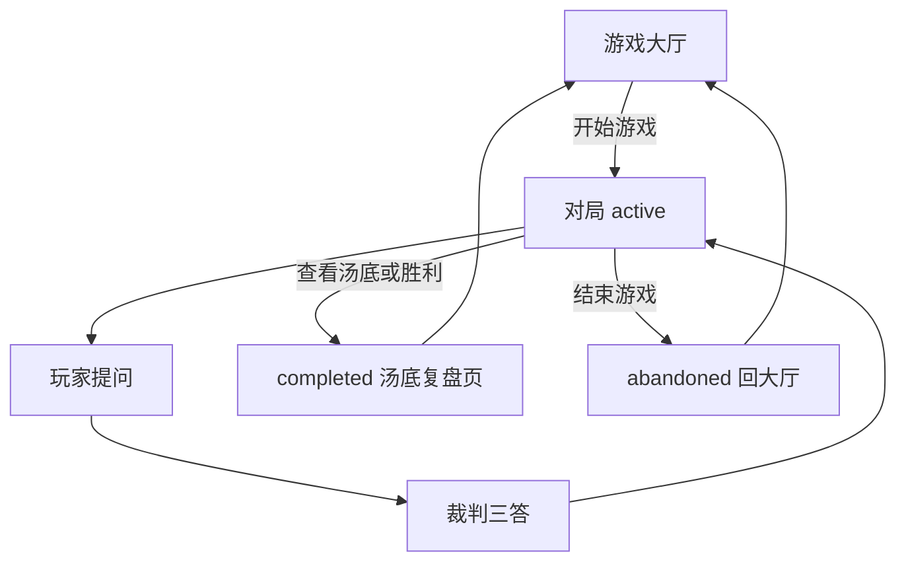

# PRD.md — AI 海龟汤游戏

略读可优先看：**§3**（局状态、**核心流程 §3.4**、**裁判 Prompt §3.5**）、**§4**（功能与界面）、**§5**（验收标准）。

## 1. 产品概述

**AI 海龟汤** 是一款由 AI 担任 **裁判**（情境推理中的「煲汤人」角色）的游戏：玩家仅看到 **汤面**，通过封闭式提问获取 **是 / 不是 / 无关** 类回答（界面可简写为 **是 / 否 / 无关**，与存储枚举 `yes` / `no` / `irrelevant` 对应），逐步还原 **汤底**。产品在保证规则一致、不剧透的前提下，提供 **局后复盘**（含每问与真相接近度）与 **个人统计数据**，帮助玩家感知进步与停留时长。

### 1.1 术语与角色（产品用语）

| 产品用语 | 含义 | 与 RESEARCH 对照 |
|----------|------|------------------|
| **汤面** | 不完整的事件描述（谜面），对玩家可见 | 同传统海龟汤「汤面」 |
| **汤底** | 完整真相与因果链，对局中隐藏，终局后展示 | 同「汤底」 |
| **裁判** | 掌握汤底真源、对每问给出三答的一方 | 对应传统玩法中的「煲汤人」 |
| **玩家** | 提问与推理的一方 | 对应「喝汤人」 |

文档其余处「AI 裁判」「三答」均指上述固定口径。

### 1.2 「无关」的 MVP 产品定义

对某一提问，裁判回答 **无关** 当且仅当（产品层写死，实现见技术设计）：

1. **不可判定**：依据结构化汤底（及裁判可用的唯一真源）无法将该问判为「与汤底一致」或「与汤底矛盾」；或  
2. **无实质帮助**：即使可想象某种解读，该问所涉信息对还原 **关键事实链** 无实质推进作用。

「无关」**不是**「与当轮回答是/否的字符串相似度低」；也与局后 **接近度**（问法与 `key_facts` 的贴合度）是不同维度，后者仅局后展示。

## 2. 目标用户

- 喜欢推理、解谜、海龟汤类玩法的休闲用户（偏年轻与大学生群体）。
- 希望 **随时单人开局**、不依赖真人组局的用户。
- 愿意接受「AI 裁判」口径、对评分与统计持「参考即可」预期的用户。

## 3. 胜负、局状态与胜利条件（MVP）

与 [TECH_DESIGN.md](./TECH_DESIGN.md) 中 `Game.status` 及 [AGENTS.md](./AGENTS.md) 统计规则对齐。本章结构：**§3.1** 状态定义 → **§3.2** 终局路径与对局按钮 → **§3.3** 胜利条件 → **§3.4** 端到端流程 → **§3.5** 裁判 Prompt。

### 3.1 局状态

| 状态 | 含义（产品） |
|------|----------------|
| `active` | 已开局、尚未终局。 |
| `completed` | 玩家走完 **已完成** 终局流程（见下），写入 `ended_at`。本状态局 **计入**「已完成游戏数」与「平均用时」。 |
| `abandoned` | 玩家主动放弃本局且未进入「已完成」终局路径（例如返回选题、明确放弃且不揭晓汤底）。**不计入** 上述核心统计。若仍写入 `ended_at`，仅用于记录本局存在与耗时，**不参与** `completed` 维度的聚合。 |

### 3.2 记为 `completed` 的终局路径（MVP）

以下两种用户操作在 **统计上等价**，均记 `completed`，均触发局后批量接近度（及汤底展示流程）：

1. **推理闭环**：玩家选择「胜利 / 我推出来了」等入口，确认后展示完整汤底并结束本局。  
2. **直接揭晓**：玩家在对局页点击 **「查看汤底」**（或等价文案），直接查看汤底并结束本局。  
   - **注意**：对局页的 **「结束游戏」** **不** 属于本路径；见下「对局页控件映射」。

**对局页控件映射（MVP）**

- **查看汤底** → 对应上文 **直接揭晓**，`status = completed`，进入 **汤底 / 复盘页**，并触发局后批量接近度。  
- **结束游戏** → 玩家放弃本局（可二次确认），`status = abandoned`，写入 `ended_at`，**不** 展示汤底、**不** 进入汤底页，返回 **游戏大厅**；不计入「已完成」统计（见 §3.1）。  
- 可选：**「胜利 / 我推出来了」** 等入口 → 对应上文 **推理闭环**，`completed`，进入汤底 / 复盘页。

产品叙事上可区分「推理成功」与「直接看答案」；**MVP 不在统计中拆分胜率**，也不在 PRD 层增加额外结果字段。

### 3.3 胜利条件（MVP）

- **不做** 依赖复杂 NLP 的「自动判赢」（与 §7 明确不做一致）。  
- MVP 以 **玩家显式终局 + 展示汤底** 作为单局闭环；是否「推对」由玩家自我认知，系统不对口述汤底做语义等价判定。

### 3.4 核心业务流程（MVP）

下列步骤与 **§4.0**（三屏内容与控件）、**§3.2**（终局路径与按钮语义）一致，供产品、测试与实现对齐。

1. **开局**：玩家在游戏大厅选题，点击 **开始游戏** → 创建本局 `Game`（须带 **`user_id`**，见 [TECH_DESIGN.md](./TECH_DESIGN.md) §3.2），`status = active`，写入 `started_at`，进入对局页。  
2. **展示汤面**：对局页展示当前题的 **汤面**（全文）；**汤底** 对玩家不可见。  
3. **提问**：玩家在输入框提交 **单个问题**（空问、过长等见 §8.3）。  
4. **裁判**：系统将本题与裁判所需上下文送达 AI（或启发式）；裁判 **仅** 产生三答之一（`yes` / `no` / `irrelevant`，UI 为 是 / 否 / 无关）。详见 **§3.5**。  
5. **写回与展示**：将该轮 **问题 + 裁判结果** 追加到 `turns`；每条回合须有 **唯一 `turn_id`** 与 **`game_id`**（与当前局一致），更新对话历史；**不得** 在对局中展示接近度。  
6. **循环**：重复步骤 3–5，直至玩家选择终局操作。  
7. **终局分支**  
   - **查看汤底** 或（可选）**胜利 / 我推出来了** → `status = completed`，写 `ended_at`，进入 **汤底 / 复盘页**；触发 **局后接近度** 批算（§4.2）。  
   - **结束游戏** → `status = abandoned`，写 `ended_at`，**不** 展示汤底、**不** 进入复盘页、**不** 批接近度，回 **游戏大厅**。  
8. **复盘与再开**：在汤底 / 复盘页阅读汤底、推理时间线、接近度（或评分失败占位）后，**再来一局** 返回大厅。



### 3.5 对局裁判：Prompt 约定（产品真源）

本节规定 **AI 判对错（三答）** 的输入边界、输出格式与系统提示词 **固定文案**。实现（含模型、温度、API 细节）见 [TECH_DESIGN.md](./TECH_DESIGN.md)；**不得弱化**下列剧透防护与三答口径。

#### 3.5.1 模型每轮可见输入

| 内容 | 说明 |
|------|------|
| 汤面 `surface` | 与玩家界面一致，可写入 prompt。 |
| 关键事实 `key_facts` | 结构化列表，辅助判定；**不得**要求模型在对玩家回复中原样复述。 |
| 完整汤底 `bottom` | **仅**允许出现在 **服务端** prompt 内，用于判真伪；**禁止**下发浏览器、禁止写入对玩家可见字段或日志中的用户可见区。 |
| 当前问题 `question` | 玩家本轮自然语言提问。 |

#### 3.5.2 输出（对玩家有效结果）

- **唯一** 合法取值：`yes` \| `no` \| `irrelevant`（与 §1.2「无关」定义一致）。  
- **MVP**：对玩家 **只展示** 三答标签（是 / 否 / 无关），**不展示** 裁判自然语言解释，避免剧透与口径漂移。  
- 若模型返回多余文字，实现层须 **解析或校验** 得到上述三选一后再落库与展示；无法解析时走 §8.3 异常体验（重试或错误提示），**不得** 用自由文本顶替三答。

#### 3.5.3 须写入系统提示的判定规则（与 §1.2 对齐）

- 问题在汤底语境下为 **真** → `yes`。  
- 与汤底 **明确矛盾** 或为 **假** → `no`。  
- **无法** 从汤底判定真价，或对还原 **关键事实链** 无实质帮助 → `irrelevant`。

#### 3.5.4 须写入系统提示的安全约束

- **反剧透**：不得输出汤面 **未出现** 而仅汤底独有的具体人名、物件、动机、结局或关键转折；不得以「提示」「猜」「接近了」等方式代推答案。  
- **格式**：仅输出规定结构化结果（见模板），不输出思考过程；若需内部 chain-of-thought，须留在不可展示链或关闭。  
- **封闭性**：鼓励玩家使用是否类问题；若问法严重歧义，优先 `irrelevant` 而非编造。

#### 3.5.5 系统提示词模板（实现可增删换行与占位符标签，不得删改约束含义）

下列字符串为 **产品真源**；占位符 `{surface}`、`{key_facts}`、`{bottom}`、`{question}` 由实现替换。

```
你是「海龟汤」游戏的裁判。玩家只能看到汤面，不能看到汤底。

【汤面】
{surface}

【关键事实（供你判题，不要在对玩家可见的任何回复中逐字复述）】
{key_facts}

【完整汤底（仅供你在内心判断真伪，严禁在对玩家可见内容中泄露）】
{bottom}

【玩家当前问题】
{question}

任务：严格依据【完整汤底】判断玩家问题应属于哪一种回答：
- 若该问题在汤底语境下为真，或可被汤底支持为「是」：answer 取 yes。
- 若该问题与汤底矛盾，或汤底支持为「否」：answer 取 no。
- 若无法依据汤底判定真价，或该问题对还原事件关键因果没有实质帮助：answer 取 irrelevant。

输出要求：只输出 **一个** JSON 对象（上述三种互斥，三选一），不要输出任何其它字符、不要 Markdown、不要解释。合法示例（择一）：
{"answer":"yes"}
{"answer":"no"}
{"answer":"irrelevant"}

禁止在输出中出现汤面未提及的剧透性实体或结局；不要给玩家解题提示或推理方向。
```

**用户消息（可选实现）**：若采用「系统提示 + 用户消息」两段式，可将 `{question}` 单独作为用户消息，系统提示中省略【玩家当前问题】段落，但 **§3.5.3–3.5.4 约束** 仍须全部落在系统提示或可审计的等效位置。

## 4. 核心功能列表

### 4.0 信息架构与页面结构（MVP）

产品由三个主界面串联（路由命名见 [TECH_DESIGN.md](./TECH_DESIGN.md)）：

1. **游戏大厅**  
   - 展示题库列表，**卡片式布局**：每卡至少含 **标题**、**难度**、**类型或标签**（字段来源可为静态 JSON 或后续扩展，实现定义）。  
   - **开始游戏**：进入对局页并创建/恢复该局。  
   - **统计区**：与 §4.3 一致，可置于大厅内或独立入口。

2. **游戏页面（对局）**  
   - 展示 **汤面**（可读性强的主文案区）。  
   - **对话区**：类似即时通讯的 **气泡时间线**（玩家提问 → 裁判三答）；底部 **输入框** 提交问题。  
   - 常驻操作：**查看汤底**、**结束游戏**（语义与 **§3.2「对局页控件映射」** 一致）。  
   - 可选：**胜利 / 我推出来了** 等第二终局入口。

3. **汤底 / 复盘页**（仅 `completed` 终局后进入）  
   - **完整汤底** 展示。  
   - **推理过程**：与本局对话历史一致，不新增剧透式事实。  
   - **每问接近度与理由**（§4.2）、评分免责声明。  
   - **再来一局**：返回游戏大厅（MVP 默认；若实现为随机下一题，须在 UI 上明示）。

**与流程图的关系**：页面跳转、对局内「提问 → 裁判 → 写回」循环及终局分支以 **§3.4** 流程图为准；本节侧重各屏 **内容与控件**。

### 4.1 MVP 玩法

| 功能 | 说明 |
|------|------|
| 选题与汤面展示 | 从题库选择一局，展示汤面；汤底对玩家隐藏直至终局。 |
| 多轮问答 | 玩家输入问题；裁判返回固定口径（是 / 不是 / 无关；界面可显示 是 / 否 / 无关）。 |
| 局内历史 | 当前局内展示已发生的「提问 → 裁判回答」时间线。 |
| 结算 | 玩家通过 §3.2 任一路径终局；写入 `ended_at` 与对应 `status`（`completed` 或 `abandoned`）。 |

### 4.2 复盘与成长（本迭代重点）

| 功能 | 说明 |
|------|------|
| 局后时间线 | 一局结束后可查看完整问答历史；与对局中展示信息一致，不新增剧透式事实。 |
| **每问接近度** | 对每条用户提问给出 **0–100 分数**（或等价档位），度量该问与 **汤底关键事实** 的相关性 / 推进程度（见下文定义）。可选一行 **简短理由**（不得泄露未公开汤底细节，需与汤面一致）。 |
| 接近度计算时机 | **终局后批量计算**（`completed` 终局后），避免对局中额外延迟与成本。 |
| 分数说明 | UI 展示「评分仅供参考，不同模型或版本可能存在波动」。 |

**接近度（产品定义，写死）**

- **对象**：用户提问文本 vs **结构化汤底中的关键事实列表**（`key_facts`），非「提问 vs 当轮是/否/无关」的字符串相似度（后者信息量过低）。
- **含义**：该问在多大程度上 **触及、收窄或对齐** 关键事实维度（人物、动机、因果、关键物件等）；高分表示问法更「在点上」，低分表示偏题或无效问法。
- **展示**：数字分 + 可选短理由；可提供低/中/高三档标签映射（例如 0–39 / 40–69 / 70–100）。

### 4.3 统计数据

| 指标（MVP） | 说明 |
|-------------|------|
| 已完成游戏数 | 当前 **`user_id`** 下，`status === completed` 的局数。 |
| 平均用时 | 同上范围内已完成局的 `(ended_at - started_at)` 算术平均；单位秒或分钟，UI 友好展示。 |
| 可选扩展（后续版本） | 平均提问轮次、胜率、最近 7 天局数、单局最短/最长用时。 |

**统计范围（MVP）**：持久化与服务端模型见 [TECH_DESIGN.md](./TECH_DESIGN.md)。每局 **`Game` 绑定 `user_id`**；大厅展示的「已完成局数」「平均用时」**仅聚合当前 `user_id`** 下 `status === completed` 的局。`user_id` 可为登录账号 ID，或 MVP 阶段由客户端签发/持久化的匿名标识（与技术设计 §5 身份策略一致）。

### 4.4 界面要求

**结构与内容**

- **统计区**：首页（大厅）或独立「统计」入口；卡片式展示 **已完成局数**、**平均用时**；空状态提示「完成一局后显示」。
- **汤底 / 复盘页**：分块布局建议：上部 **真相揭晓**（汤底全文），下部 **推理过程 + 接近度**；每条含 **问题全文**、**裁判回答**、**接近度分数**（条形或色块 + 数字）、**理由**（可折叠）。
- **对局页**：对话流 **类似主流 IM**（如微信式左右气泡或等价），保证提问与回答一一对应、时序清晰。

**视觉与氛围**

- **整体风格**：神秘、悬疑；**深蓝色调** 为主色，辅以适度对比色保证可读与无障碍。
- **游戏大厅**：卡片式栅格，突出标题与难度，hover/焦点态可轻微强化「可进入」暗示。
- **汤底页**：**揭晓仪式感**（如分段标题、留白、可选轻量过渡动效）；动效须可降级、不阻塞阅读。
- **通用**：清晰层级、移动端可读；分数与理由不抢夺汤面与汤底主体阅读。

## 5. 用户故事与验收标准

### 5.1 用户故事（MVP）

1. 作为玩家，从 **游戏大厅** 选题并开始游戏后，能看到汤面，多轮输入问题并看到裁判回答与局内时间线。  
2. 作为玩家，在 **对局中** 只能看到历史问答，**看不到** 每问接近度分数或档位。  
3. 作为玩家，在 **终局后**（`completed`）可打开局后复盘页，看到与局内一致的历史，并看到每条提问的接近度（或评分失败时的占位说明）。  
4. 作为玩家，在 **游戏大厅** 或统计入口看到已完成局数与平均用时；尚无任何 `completed` 局时看到友好空状态。  
5. 作为玩家，在局后评分加载或失败时，仍能阅读问答历史；接近度区域展示加载中、重试或「评分暂不可用」等状态，不阻塞复盘页可用性。

### 5.2 验收标准（可检查）

- **无对局中剧透式评分**：对局进行过程中，界面 **不得** 展示 `proximity_score`、档位标签或等价「本题得分」信息。  
- **仅终局后批算**：接近度与理由 **仅在** 本局进入 `completed` 并触发批量评分流程后写入展示（含启发式 / LLM 路径）；与 [AGENTS.md](./AGENTS.md)「接近度仅在对局进入终局流程后写入」一致。  
- **裁判输出**：对局中玩家可见的裁判反馈 **仅为** 三答之一；符合 §3.5.2。  
- **统计范围**：「已完成游戏数」「平均用时」**仅** 统计 **当前用户**（`user_id`）下 `status === completed` 且具备有效 `started_at` / `ended_at` 的局。  
- **声明展示**：接近度相关界面须可见「评分仅供参考…」类说明（见 §4.2）。  
- **`abandoned` 隔离**：被放弃局不得抬高已完成计数或拉入平均用时计算。  
- **结束游戏语义**：玩家通过对局页 **「结束游戏」** 退出时，须记为 **`abandoned`**，**不得** 进入汤底 / 复盘页，**不得** 触发「已完成」统计；与 **「查看汤底」**（`completed`）在流程上明确区分。

## 6. 功能优先级

| 阶段 | 内容 |
|------|------|
| **MVP** | **游戏大厅 + 对局页 + 汤底复盘页**（§4.0）；三答裁判与 **§3.5 Prompt**；**§3.4** 核心流程；持久化与 `started_at`/`ended_at`；局状态与统计口径（§3.1–§3.2）；已完成统计、平均用时；局后批量接近度 + 历史展示；§4.4 视觉与布局要求。 |
| **后续** | **用户登录与账号**；**跨设备游戏记录 / 云同步**；UGC / **自定义海龟汤**；**多人对战或房间模式**；嵌入相似度 + LLM 理由混合；若做排行榜，仅限 **私域或房间维度**（默认 **不做** 全球 / 公开好友榜）；更多图表与趋势。 |

## 7. 明确不做（MVP）

- 全球/好友排行榜与公开排名。
- 对局中实时显示接近度（仅局后）。
- 未定义胜利条件时的「自动判赢」复杂 NLP（可在后续 PRD 单列）。
- 在「已完成」统计中按「推理成功 vs 直接揭晓」拆分胜率或展示排行榜（MVP 不做）。

## 8. 非功能需求与边界体验

### 8.1 性能与可用性

- 局后评分允许异步；失败可重试；最终失败时对应轮次展示「评分暂不可用」，**不阻塞** 将本局标为 `completed` 或展示汤底与问答历史（与实现上「保留 null 分数」策略一致，见技术设计）。

### 8.2 合规

- 题库与 UGC（若有）需内容安全策略；理由生成需防剧透校验（技术设计细化）。

### 8.3 输入与异常（产品层）

- **空问题或无效输入**：不提交裁判；提示用户输入问题，并可引导改为是否类封闭式问法（具体校验与字数上限由实现定义）。  
- **过长输入**：实现可截断或提示超限，以不破坏对局流畅为准。  
- **裁判或模型异常**：对局中可重试当前问或展示通用错误文案，不泄露汤底。

## 9. 成功指标与差异化（内部 MVP）

### 9.1 成功指标（定性为主）

无账号或早期 MVP 阶段，以 **定性观察** 为主（与 §4.3 持久化形态无关：无论本地或服务端存档，均可主观观察），例如：玩家是否完成首局闭环、局后是否进入复盘页、平均单局停留时长是否合理。不强制线上埋点口径；若后续接分析，可再细化「完成率」「复开局数」等定义。

### 9.2 竞品与差异化（摘要）

线上海龟汤多为真人主持或固定选项分支；本产品的组合差异在于：**开放式自然语言提问** + **严格三答裁判** + **结构化汤底 / 关键事实** 保证口径一致，并在局后提供 **与 `key_facts` 对齐的接近度反馈** 与个人统计，在单人、低组局成本场景下形成闭环。

## 10. 文档衔接

- 研究背景与规则渊源：[RESEARCH.md](./RESEARCH.md)（其中 §7 待决问题已由本文 §1.2、§3 等承接）。  
- 实现细节：[TECH_DESIGN.md](./TECH_DESIGN.md)（裁判实现须对齐本文 **§3.5**）。  
- AI 代理规范：[AGENTS.md](./AGENTS.md)

---

*版本：0.4.3 — §4.3 指标表显式限定当前 `user_id`。（0.4.2：`user_id` / 回合 id。）*
