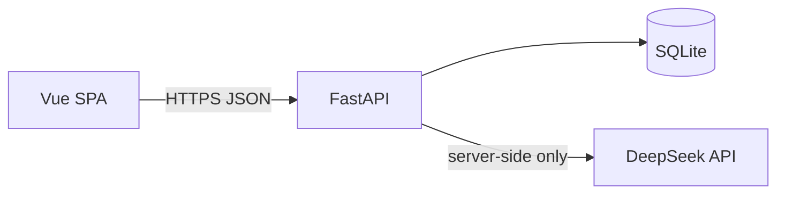

# TECH_DESIGN.md — AI 海龟汤

本文档描述 **MVP 技术实现**：与 [PRD.md](./PRD.md) 玩法、状态机、§3.5 裁判 Prompt 对齐；与 [AGENTS.md](./AGENTS.md) 单一数据源与测试约定对齐。

---

## 1. 技术栈

| 层级 | 选择 | 说明 |
|------|------|------|
| **前端** | Vue 3 + TypeScript + Vite + Tailwind CSS | SPA；大厅、对局 IM 流、汤底复盘；**仅**通过 HTTP 调用后端，**不**持有 LLM Key。 |
| **后端（MVP）** | Python + FastAPI | **代理**调用 LLM；提供 **裁判**（对局三答）与 **局后接近度** 批量评分接口；统一校验与持久化。 |
| **持久化（MVP）** | FastAPI + **SQLite** | 服务端单文件库（如 `data/app.db`）或等价路径；`Game` / 题库元数据均以服务端为真源。 |
| **测试** | **Vitest**（前端）+ **pytest**（后端，可选） | 前端：`computeStats`、组件与 API 客户端 mock；后端：统计聚合、启发式评分 **区间**、存储层或 **OpenAPI 契约**；**无密钥 CI** 不调用真实 LLM。 |
| **LLM** | **DeepSeek**（OpenAI 兼容 **Chat Completions** API） | 裁判与局后评分；密钥 **仅** 存在于后端环境变量。 |

**架构要点**



- 浏览器构建产物中 **不得** 出现 `DEEPSEEK_API_KEY`。  
- 前端通过 `VITE_API_BASE_URL` 指向后端；本地开发常见为 `http://127.0.0.1:8000`。

**部署（参考）**

- 前端：静态托管（如 Vercel、Netlify、对象存储 + CDN）。  
- 后端：与 SQLite 文件同机或可挂载卷的主机（Railway、Fly.io、VPS 等）。若改用托管 Postgres，属后续迭代，不在本文 MVP 范围。

---

## 2. 项目结构（示意）

```
haiguitang/
  PRD.md
  TECH_DESIGN.md
  AGENTS.md
  RESEARCH.md
  frontend/
    package.json
    vite.config.ts
    tailwind.config.ts
    tsconfig.json
    index.html
    src/
      main.ts
      App.vue
      router/                 # /, /play/:gameId, /review/:gameId
      views/
        LobbyView.vue
        GamePlayView.vue
        SoupRevealView.vue
      components/
      api/                    # fetch 封装：games、soups、judge 副作用含于「提交回合」内等
      lib/
        stats.ts              # computeStats(Game[]) — 与 PRD 统计一致
      types.ts
    src/lib/__tests__/        # Vitest
  backend/
    pyproject.toml            # 或 requirements.txt
    app/
      main.py                 # FastAPI app、CORS、挂载路由
      config.py               # 环境变量、DATABASE_URL
      db.py                   # SQLAlchemy engine、Session、建表
      models.py               # ORM：GameRow、SoupRow（或 JSON 列存 turns）
      schemas.py              # Pydantic：Game、Turn、Soup API 形状
      routers/
        soups.py
        games.py              # CRUD、complete、abandon、触发 score
        judge.py              # 或合并进 games：对内 service
      services/
        llm_deepseek.py       # httpx + OpenAI 兼容 client
        judge_service.py      # 组装 PRD §3.5 prompt、解析 JSON
        score_service.py      # batch 接近度 + 启发式降级
        heuristic_judge.py
        heuristic_score.py
    data/
      app.db                  # SQLite（gitignore）
    tests/                    # pytest（可选）
      test_stats.py
      test_heuristic_score.py
      test_games_api.py
  data/
    soups.json                # 题库源文件；可由 seed 脚本导入 DB
```

---

## 3. 数据模型

与 PRD 一致；API 往返 JSON 使用 **camelCase** 或 **snake_case** 须前后端统一（推荐 API **snake_case** + 前端类型映射，或全项目 camelCase 二选一写死）。

### 3.1 题库 `Soup`

静态内容可由 SQLite 表 `soups` 存储，或启动时从 `data/soups.json` 导入。

```ts
type Soup = {
  id: string;
  title: string;
  surface: string;           // 汤面（展示给玩家）
  bottom: string;            // 完整汤底（仅服务端判题 / 结算后展示）
  key_facts: string[];       // 结构化关键事实
  // 可选：difficulty, tags[] — PRD 大厅卡片
  soup_version?: string;     // 可与 id+内容哈希对应，写入 Game.soup_version
};
```

### 3.2 一局游戏 `Game`

| 字段 | 类型 | 说明 |
|------|------|------|
| `id` | string | 局 ID（UUID） |
| `user_id` | string | **玩家标识**；统计与列表按该字段隔离；MVP 可为登录用户 ID，或客户端首次生成的匿名 UUID（持久化于本地后每次请求携带），详见 §5。 |
| `soup_id` | string | 外键关联题库 |
| `status` | `'active' \| 'completed' \| 'abandoned'` | `completed` 计入统计 |
| `started_at` | number | Unix ms |
| `ended_at` | number \| null | 终局写入 |
| `turns` | `Turn[]` | 有序问答 |
| `soup_version` | string | 题库版本，评分缓存语义 |

### 3.3 回合 `Turn`

每条回合 **必须** 可独立寻址，并与所属局关联。

| 字段 | 类型 | 说明 |
|------|------|------|
| `id` | string | **回合 ID**（UUID）；服务端在插入回合时生成，全局唯一。 |
| `game_id` | string | **所属局 ID**；须与父级 `Game.id` 一致（嵌套在 `Game.turns` 内亦须写入，便于日志、同步或未来拆表）。 |
| `question` | string | 用户提问 |
| `answer` | `'yes' \| 'no' \| 'irrelevant'` | 裁判三答 |
| `proximity_score` | number \| null | 0–100，**局后**写入 |
| `proximity_rationale` | string \| null | 短理由；无剧透策略见 §4.4 |
| `scored_at` | number \| null | 评分完成时间 |

### 3.4 存储（SQLite）

**推荐实现（MVP）**

- 表 `games`：`id` TEXT PK，`user_id` TEXT **NOT NULL**，`soup_id` TEXT，`status` TEXT，`started_at` INTEGER，`ended_at` INTEGER，`soup_version` TEXT，`turns` **JSON** TEXT（序列化 `Turn[]`，每条含 `id`、`game_id` 及上表其余字段）。  
- **可选规范化**：另建表 `turns`（`id` PK，`game_id` FK → `games.id`，`turn_index` INTEGER，及 `question`/`answer`/评分列），与 PRD 一局多回合一致；与 JSON 方案二选一或迁移时并存。  
- 表 `soups`：与 `Soup` 字段对应；`key_facts` 存 JSON 数组。

**索引建议**：`games(user_id)`、`turns(game_id)`（若拆表）。

**约束**

- 所有状态迁移与 `turns` 更新 **仅** 经 FastAPI 服务层，满足 [PRD.md](./PRD.md) §3 状态机。  
- 前端 **禁止** 将 `Game` / `Turn` 作为主真源写入 `localStorage`（仅可存 `user_id` 匿名令牌等 **非对局快照**）；对局数据以服务端为准。

---

## 4. 关键技术点

### 4.1 裁判（对局中）

**产品真源**：[PRD.md](./PRD.md) **§3.5**（输入边界、JSON 输出、反剧透）。

**流程**

1. 前端提交「本轮问题」：`POST /api/games/{id}/turns`（body：`{ question }`），或等价「一步提交问题并由服务端判题」接口。  
2. 服务端加载 `Game` + `Soup`，若 `status !== 'active'` 则 4xx。  
3. **有 `DEEPSEEK_API_KEY`**：`judge_service` 按 PRD §3.5.5 组装 system/user 消息，调用 DeepSeek Chat Completions；解析 **唯一** `{"answer":"yes"|"no"|"irrelevant"}`（容错：strip markdown fence、JSON 修复）。  
4. **无密钥 / 失败降级**：`heuristic_judge(question, key_facts)` → 映射为 `yes` / `no` / `irrelevant`（与 AGENTS：CI 可全走启发式）。  
5. 生成 `Turn.id`（UUID），写入 `Turn.game_id = Game.id`，追加回合（仅写 `question`、`answer`；`proximity_*` 仍为 null），`commit`，返回更新后的 `Game`。

**限制**：启发式用于测试与降级；线上以 LLM 为准时可加开关。

### 4.2 局后接近度评分

**触发**：客户端在玩家选择「查看汤底」或「胜利」完成终局后，调用 `PATCH /api/games/{id}/complete`（或 `POST .../complete`）设置 `completed` + `ended_at`；服务端在同一请求内或 **异步任务** 中调用 `batch_score_game(game_id)`。

**流程**

1. 若每条 `turn.proximity_score !== null`，跳过。  
2. **有 LLM**：单次请求批量评分；注入 `surface`、`key_facts`、所有 `question`（可附 `turn.id` 列表便于对齐）；要求返回 JSON 数组，元素含 `index`（与 `turns` 数组下标一致）或 `turn_id`（与 `Turn.id` 一致，二选一写死）、`score`（0–100）、`rationale`（短、无剧透，约束同 PRD / §4.4）。  
3. **无 LLM**：`heuristic_score` 逐问打分 + 模板理由。  
4. 失败：**最多重试 2 次**；仍失败则对应 `proximity_score = null`，不阻塞 `completed`。  
5. 写回 `turns` JSON 列并持久化。

### 4.3 统计聚合

- **前端**：`computeStats(games: Game[])`（Vitest 覆盖），入参须为 **同一 `user_id`** 下的局列表（或先 `filter(g => g.user_id === currentUserId)`）。  
- **规则**：`completedCount` = `status === 'completed' && ended_at && started_at`；`averageDurationMs` = 均值 `(ended_at - started_at)`；无 completed 时平均为 `null`。

### 4.4 无剧透理由（LLM 路径）

接近度 `rationale` 仅使用汤面已公开信息 + 问题 + 泛泛维度；禁止汤底独有名词与因果（与 PRD、AGENTS 一致）。

---

## 5. HTTP API（草案）

路径前缀可统一 `/api`。以下为最小闭环，名称实现时可微调。

| 方法 | 路径 | 说明 |
|------|------|------|
| GET | `/api/soups` | 大厅列表（不含 `bottom`，可不含 `key_facts`） |
| GET | `/api/soups/{soup_id}` | 对局所需：至少 `surface`；`bottom`/`key_facts` **不** 返回给前端 |
| POST | `/api/games` | body：`{ soup_id, user_id }` → 创建 `active`，写 `started_at`；`user_id` 须与后续请求的认证或约定头一致（见下） |
| GET | `/api/games/{id}` | 获取局（含 `turns`）；**仅当** `game.user_id` 与请求身份匹配时 200，否则 404。**`bottom`**：对局中（`active`）**不得**返回；`completed` 后须在响应中提供完整汤底（字段名 `bottom` 或嵌套 `soup.bottom`，实现二选一写死），供复盘页展示，与 [PRD.md](./PRD.md) 汤底页一致。 |
| POST | `/api/games/{id}/turns` | body：`{ question }` → 裁判 → 追加回合（新 `Turn` 带新 `id` 与 `game_id`）；**须**校验该局 `user_id` 与请求身份一致（与 GET 相同规则）。 |
| PATCH | `/api/games/{id}/complete` | `completed` + `ended_at` → 触发 batch score；校验 `user_id` |
| PATCH | `/api/games/{id}/abandon` | `abandoned` + `ended_at`；校验 `user_id` |
| GET | `/api/games` | query：`user_id`（必填）→ 仅返回该用户的局，供统计与历史 |

**身份与 `user_id`（MVP）**

- 请求须携带可校验的 **`user_id`**：`POST /api/games` 可在 body 中传 `user_id`；后续带 `{id}` 的请求 **必须** 用与创建该局时 **同一** 身份（推荐头 `X-User-Id` 或与 session 推导的 ID），且 **等于** `Game.user_id`；body 中重复传 `user_id` 时须与头/会话一致，否则 403。  
- **生产环境**应将 `user_id` 与登录会话（JWT / session）绑定，**禁止** 仅凭客户端任意伪造他人 ID 拉取数据；MVP 无登录时可用「首次生成的匿名 UUID + HttpOnly Cookie 或安全存储」降低冒领风险。  
- 所有读写 `Game` / `Turn` 的接口须校验 **资源所属 `user_id`**。

**CORS**：允许前端源；生产须收紧 `allow_origins`。

---

## 6. 环境变量

| 变量 | 层级 | 用途 |
|------|------|------|
| `DATABASE_URL` | 后端 | 如 `sqlite:///./data/app.db` |
| `DEEPSEEK_API_KEY` | 后端 | 可选；缺省则裁判与评分走启发式 |
| `DEEPSEEK_BASE_URL` | 后端 | 默认 `https://api.deepseek.com` |
| `DEEPSEEK_MODEL` | 后端 | 如 `deepseek-chat` |
| `VITE_API_BASE_URL` | 前端构建 | 后端根 URL，如 `http://127.0.0.1:8000` |

**安全**：密钥仅存服务端；仓库与 CI 使用占位或空值 + mock。

---

## 7. 测试矩阵（MVP）

| 范围 | 工具 | 内容 |
|------|------|------|
| 统计 | Vitest | `computeStats`：空列表；仅 active；多局 completed；**同 `user_id` 过滤**；计数与平均耗时 |
| 启发式接近度 | pytest 或 Vitest（若逻辑共享则后端测） | fixture `Soup` + 固定 `question`，`heuristic_score` 落在约定 **区间** |
| 启发式裁判 | pytest | 固定输入 → `yes`/`no`/`irrelevant` 符合预期（可少量表驱动） |
| API | pytest + TestClient | 创建局（含 `user_id`）→ 回合含 `id`/`game_id` → complete → `turns` 含 `answer`；越权用户 404；abandon 不写入接近度 |
| LLM | — | **默认 mock**；不依赖真实 DeepSeek（`describe.skipIf` / 环境变量门控） |

---

## 8. 与 PRD 的对应关系

| PRD | 技术落点 |
|-----|----------|
| §3 状态机、`completed` / `abandoned` | `games` 表 `status`、`ended_at`；`complete` / `abandon` 接口 |
| §3.4 核心流程 | 前端路由 + 上述 API 顺序 |
| §3.5 裁判 Prompt | `judge_service` 模板与解析 |
| §4.0 三屏 | `LobbyView` / `GamePlayView` / `SoupRevealView` |
| §4.2 局后接近度 | `score_service` + `PATCH complete` 触发 |
| §4.3 统计 | `computeStats` + 大厅展示；按 `Game.user_id` 过滤 |

---

*版本：1.1.1 — 补齐：`completed` 后 `GET /games/{id}` 返回 `bottom`；`POST .../turns` 身份校验；批分可 `turn_id` 对齐；`user_id` 头/body 一致；去 localStorage 过时表述。*
